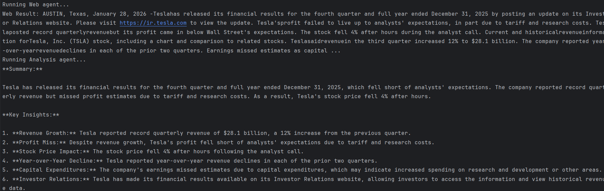

QueryPilot AI – Multi‑Agent Data Intelligence System

Overview
QueryPilot AI is a multi‑agent AI system that answers complex user questions by combining structured database data and real‑time web information.

Instead of relying on a single model, the system uses specialized AI agents that collaborate to produce insights.

Example:
User Query: "Get Tesla revenue and latest news"

System Process:
1. SQL Agent queries the database for Tesla revenue
2. Web Search Agent retrieves recent Tesla news
3. Analysis Agent combines both results and produces insights

This project demonstrates how LLMs can orchestrate multiple tools to solve real‑world data intelligence problems.
Architecture
User Query
   │
   ▼
Router / Main Controller
 ├── SQL Agent → Fetch structured data from database
 ├── Web Search Agent → Retrieve latest web information
 └── Analysis Agent → Combine both sources and generate insights

Tech Stack
• Python
• LangChain
• Groq LLM (Llama 3.1)/ OpenAI GPT‑4
• MySQL
• SQLAlchemy
• Multi‑Agent Architecture
• dotenv for environment management

Features
• Natural language to SQL query generation
• Real‑time web information retrieval
• Multi‑agent collaboration
• AI‑generated insights from multiple data sources
• Modular and scalable architecture

Example Query
Query:
Get Tesla revenue and latest news
Example Output
Tesla reported approximately $96.77B revenue in 2023.
Recent news indicates Tesla continues expanding EV production globally.

Insights:
Tesla’s financial growth aligns with increasing demand in the electric vehicle market and ongoing expansion into new regions.
Installation
1. Clone the repository
git clone https://github.com/archanani/querypilot-ai

2. Navigate to the project
cd querypilot-ai

3. Create virtual environment
python -m venv venv

4. Activate environment
Windows:
venv\Scripts\activate

5. Install dependencies
pip install -r requirements.txt
Environment Variables
Create a .env file and add the following:

GROQ_API_KEY=your_groq_api_key
MYSQL_USER=your_mysql_user
MYSQL_PASSWORD=your_mysql_password
MYSQL_HOST=localhost
MYSQL_PORT=3306
MYSQL_DB=db_name
Run the Project
Run the application from the project root:

python -m src.main
Future Improvements
• Add Router Agent for intelligent tool selection
• Integrate LangGraph for agent orchestration
• Add vector search for knowledge retrieval
• Build a Streamlit UI dashboard
• Add real‑time streaming responses

This project demonstrates practical implementation of multi‑agent AI systems using modern LLM 
